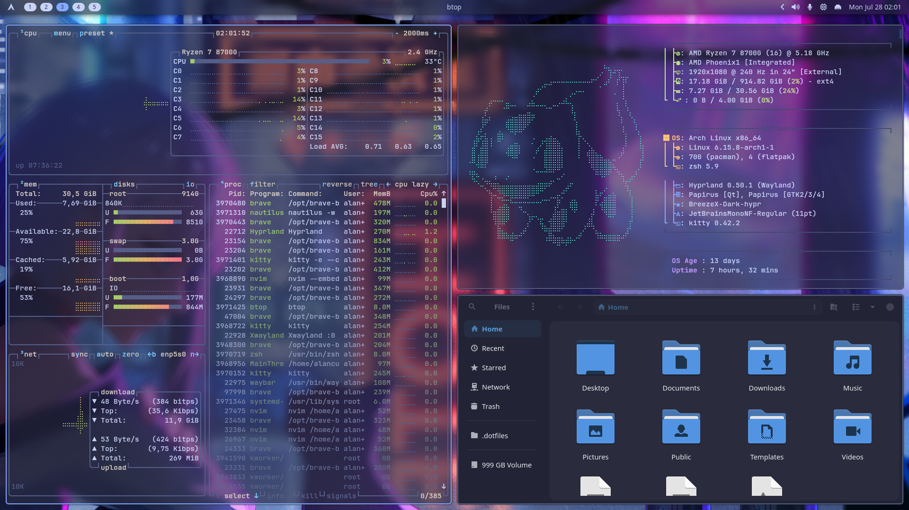

# Welcome to my Dotfiles

Hi! This is my guide to what you are expected to find when using my Dotfiles for to setup your digital environment. It supports [Arch Linux](#arch-linux-hyprland), [MacOS](#macos-aerospace) and [Windows](#windows-11).

## Gallery




## Installation

Currently, only manual installation is supported, but in the near future I hope to write an automatic installation script for each platform supported.

### Arch Linux (Hyprland)

> [!tip]
> For a reference list of all packages used, you can [check below](#arch-linux-packages).

This is my primary environment and where most of my daily usage happens, so it's much more mature when compared to my dotfiles for other environments.

It's built on top of the [Hyprland](https://hypr.land/) wayland compositor, with huge inspiration from a lot of different rices throughout the internet, to see which inspirations are these, check the "[Inspirations](#inspirations)" section.

#### Install Packages

The first step is to install Yay and Git.

```shell
sudo pacman -S --needed git base-devel && git clone https://aur.archlinux.org/yay.git && cd yay && makepkg -si
```

Then it's necessary to install the **Core Packages**.

```shell
yay -Sy pipewire pipewire-alsa pipewire-audio pipewire-jack pipewire-pulse gst-plugin-pipewire wireplumber networkmanager nm-connection-editor network-manager-applet bluez bluez-utils bluetui brightnessctl playerctl udiskie uwsm hyprland hyprpaper hyprlock hyprpicker hypridle hyprpolkitagent xdg-desktop-portal-hyprland xdg-desktop-portal-gtk libnotify dunst rofi-git waybar grim slurp cliphist wl-clipboard wl-clip-persist ly xdg-user-dirs zsh starship btop fastfetch ffmpeg imagemagick ripgrep fzf fd less unzip jq luarocks pacman-contrib wget tuckr-git qt5-wayland qt6-wayland kvantum kvantum-qt5 qt5ct-kde qt6ct-kde gtk3 gtk4 nwg-look brave-bin kitty nautilus tumbler ffmpeg-audio-thumbnailer ffmpegthumbnailer neovim-nightly mpv nsxiv zathura zathura-pdf-mupdf zk lazygit lazydocker asdf-vm xwaylandvideobridge noto-fonts-emoji noto-fonts noto-fonts-cjk noto-fonts-extra ttf-ia-writer ttf-jetbrains-mono-nerd ttf-jetbrains-mono ttf-fira-sans ttf-fira-code ttf-firacode-nerd sassc gtk-murrine-engine gnome-themes-extra yazi 7zip poppler zoxide resvg ntfs-3g gnome-keyring libqalculate rofi-calc rofi-emoji wiremix
```

Optionally you can also install the **Extra Packages**.

```shell
yay -Sy obs-studio obsidian-bin libreoffice-fresh faltpak pokemon-colorscripts-git github-cli
```

Then you can remove all unused packages currently installed.

```shell
sudo pacman -Rsn $(pacman -Qdtq)
```

##### Install the WSL version (Optional)

Alternatively you can install the WSL version:

```shell
yay -Sy neovim-nightly luarocks ripgrep fastfetch zsh starship xdg-ninja stow pacseek less fzf zk btop lazydocker lazygit
```

Install the clipboard manager for WSL integration on windows:

```shell
winget install --id=equalsraf.win32yank  -e
```

#### Install Oh-My-Zsh!

To proceed run the following command

```shell
sh -c "$(curl -fsSL https://raw.githubusercontent.com/ohmyzsh/ohmyzsh/master/tools/install.sh)"
```

Next, install the **zsh autosuggestions** plugin:

```shell
git clone https://github.com/zsh-users/zsh-autosuggestions \
  $ZSH_CUSTOM/plugins/zsh-autosuggestions
```

Then, install the **zsh vi mode** plugin:

```shell
git clone https://github.com/jeffreytse/zsh-vi-mode \
  $ZSH_CUSTOM/plugins/zsh-vi-mode
```

#### Install NodeJS, Yarn, pnpm and Rust

Add NodeJS to the ASDF plugins list:

```shell
asdf plugin add nodejs
```

Install the latest version:

```shell
asdf install nodejs latest
```

Set the latest version of node globally:

```shell
asdf set nodejs latest --home
```

Then, install yarn:

```shell
npm i -g yarn
```

Finally, install pnpm:

```shell
npm i -g pnpm
```

Add Rust to the ASDF plugins list:

```shell
asdf plugin add rust
```

Install the stable version of rust:

```shell
asdf install rust stable
```

Set the stable version of rust globally:

```shell
asdf set rust stable --home
```

Then install short-unique-id with npm. This is used to generate unique short ids in my note taking system.

```shell
npm install --global short-unique-id
```

Add java to the ASDF plugins list:

```shell
asdf plugin add rust
```

Install the correct java version:

```shell
asdf install java latest:adoptopenjdk-11
```

Set the java version globally:

```shell
asdf set java latest:adoptopenjdk-11 --home
```

#### Enable required services under systemd

Waybar:

```shell
systemctl --user enable --now waybar.service
```

Hyprerland Poolkit Agent:

```shell
systemctl --user enable --now hyprpolkitagent.service
```

Hyprpaper:

```shell
systemctl --user enable --now hyprpaper.service
```

Hypridle:

```shell
systemctl --user enable --now hypridle.service
```

Bluetooth:

```shell
sudo systemctl enable --now bluetooth.service
```

Ly Display Manager:

```shell
sudo systemctl enable --now ly.service
```

#### Download and install the themes

Follow the instructions provided on my
[Themes](https://github.com/alancunha26/Themes) repository.

#### Download and install the dotfiles

First you need to download the dotifles from the git repository:

```shell
git clone git@github.com:alancunha26/Dotfiles.git ~/.dotfiles
```

Then you have to run the following command.

```shell
tuckr set \* -f
```

Whenever you create a new file you must run `tuckr` again and clear the broken
symlinks:

```shell
tuckr set \* & find -xtype l -delete
```

#### Setup Gaming

Run games on steam with gamescope by pasting this on Steam launch options:

```shell
gamescope -w 1920 -h 1080 -r 240.0 -b -e --backend=sdl --adaptive-sync --force-grab-cursor -- %command%
```

#### Common Fixes

To fix a ntfs drive just you can try to run:

-> Check [here](https://wiki.archlinux.org/title/NTFS#Unable_to_mount_with_ntfs3_with_partition_marked_dirty)

```shell
sudo ntfsfix -d PATH_TO_VOLUME
```

To fix audio/mic problems setup configuration with `alsamixer` and then run the following:

```shell
sudo alsactl store
```

#### Arch Linux Packages

_Core Packages_

| Package                     | Description                                     |
| --------------------------- | ----------------------------------------------- |
| pipewire                    | Audio/video server                              |
| pipewire-alsa               | Pipewire alsa client                            |
| pipewire-audio              | Pipewire audio client                           |
| pipewire-jack               | Pipewire jack client                            |
| pipewire-pulse              | Pipewire pulseaudio client                      |
| gst-plugin-pipewire         | Pipewire gstreamer client                       |
| wireplumber                 | Pipewire session manager                        |
| networkmanager              | Network manager                                 |
| nm-connection-editor        | GUI Network manager editor                      |
| network-manager-applet      | GUI Network manager applet                      |
| bluez                       | Bluetooth protocol stack                        |
| bluez-utils                 | Bluetooth utility cli                           |
| bluetui                     | Bluetooth manager tui                           |
| brightnessctl               | Screen brightness control                       |
| playerctl                   | Media controls                                  |
| udiskie                     | Manage removable media                          |
| uwsm                        | Universal wayland session manager               |
| hyprland                    | Wayland compositor based on wlroots-based       |
| hyprpaper                   | Wallpapers                                      |
| hyprlock                    | Lock screen                                     |
| hyprpicker                  | Color picker                                    |
| hypridle                    | Idle manager                                    |
| hyprpolkitagent             | Authentication agent                            |
| xdg-desktop-portal-hyprland | xdg desktop portal for hyprland                 |
| xdg-desktop-portal-gtk      | File picker and dbus integration                |
| xwaylandvideobridge         | Screen sharing of XWayland apps                 |
| libnotify                   | For notifications                               |
| dunst                       | Notification daemon                             |
| rofi-git                    | Application launcher                            |
| waybar                      | System bar                                      |
| grim                        | Screenshot tool                                 |
| slurp                       | Region selector for screenshot/screenshare      |
| cliphist                    | Clipboard manager                               |
| wl-clipboard                | Clipboard utilities for wayland                 |
| wl-clip-persist             | Persist clipboard after programs close          |
| ly                          | TUI display manager                             |
| xdg-user-dirs               | Manage user directories                         |
| zsh                         | Shell                                           |
| starship                    | Shell prompt                                    |
| btop                        | Process viewer                                  |
| fastfetch                   | System information tool                         |
| ffmpeg                      | Record, convert and stream audio and video      |
| imagemagick                 | Image processing                                |
| ripgrep                     | Regex directory searcher                        |
| fzf                         | CLI fuzzy finder                                |
| fd                          | CLI fuzzy finder                                |
| less                        | Terminal based program for viewing text         |
| unzip                       | Zip extractor                                   |
| jq                          | JSON processor                                  |
| luarocks                    | Lua package manager                             |
| pacman-contrib              | Scripts and tools for pacman systems            |
| wget                        | Network utility to retrieve files from the web  |
| tuckr-git                   | Dotfiles manager                                |
| qt5-wayland                 | Wayland support in qt5                          |
| qt6-wayland                 | Wayland support in qt6                          |
| kvantum                     | Svg based qt6 theme engine                      |
| kvantum-qt5                 | Svg based qt5 theme engine                      |
| qt5ct-kde                   | qt5 configuration tool                          |
| qt6ct-kde                   | qt6 configuration tool                          |
| gtk3                        | Gnome 3                                         |
| gtk4                        | Gnome 4                                         |
| nwg-look                    | GTK configuration tool                          |
| brave-bin                   | Web browser                                     |
| kitty                       | Terminal emulator                               |
| nautilus                    | GUI file manager                                |
| ffmpegthumbnailer           | Video thumbnails for nautilus                   |
| ffmpeg-audio-thumbnailer    | Audio thumbnails for nautilus                   |
| tumbler                     | Thumbnails for evey file manager (not nautilus) |
| neovim-nightly              | Terminal text editor                            |
| mpv                         | Video player                                    |
| nsxiv                       | Simple image viewer                             |
| zathura                     | Simple document viewer                          |
| zathura-pdf-mupdf           | PDF and Epub support for zathura                |
| lazygit                     | Simple terminal UI for git commands             |
| lazydocker                  | TUI docker manager                              |
| zk                          | Zettelkasten note taking LSP                    |
| sassc                       | Deps for GTK Theme                              |
| gtk-engine-murrine          | Deps for GTK Theme                              |
| gnome-themes-extra          | Deps for GTK Theme                              |
| yazi                        | TUI file manager                                |
| 7zip                        | Archiving for yazi                              |
| poppler                     | Pdf preview for yazi                            |
| zoxide                      | Historical directories navigation for yazi      |
| resvg                       | Svg preview yazi                                |
| ntfs-3g                     | NTFS filesystem driver and utilities            |
| gnome-keyring               | Gnome keyring                                   |
| wiremix                     | TUI audio manager                               |
| libqalculate                | Powers rofi calculator                          |
| rofi-calc                   | Rofi calculator                                 |
| rofi-emoji                  | Rofi emoji                                      |
| noto-fonts-emoji            | -                                               |
| noto-fonts                  | -                                               |
| noto-fonts-cjk              | -                                               |
| noto-fonts-extra            | -                                               |
| ttf-ia-writer               | -                                               |
| ttf-jetbrains-mono-nerd     | -                                               |
| ttf-jetbrains-mono          | -                                               |
| ttf-fira-sans               | -                                               |
| ttf-fira-code               | -                                               |
| ttf-firacode-nerd           | -                                               |

_Extra Packages (Optional)_

| Package            | Description                         |
| ------------------ | ----------------------------------- |
| obs-studio         | Live streaming and recording        |
| obsidian-bin       | Markdown note taking app            |
| libreoffice-fresh  | Open-source office suite            |
| flatpak            | Run sandboxed applications on Linux |
| qbittorrent        | Trusted torrent client              |
| proton-vpn-gtk-app | Proton VPN                          |

_Gaming Packages (Optional)_

> See more in the wiki: [Gaming](https://wiki.archlinux.org/title/Gaming), [Steam](https://wiki.archlinux.org/title/Steam)

| Package        | Description                                |
| -------------- | ------------------------------------------ |
| steam          | Valve's digital software delivery system   |
| gamescope      | SteamOS session compositing window manager |
| retroarch      | Reference frontend for the libretro API    |
| corectrl       | AMD GUI hardware control                   |
| ttf-liberation | Arial font used for steam                  |

### MacOS (Aerospace)

TODO

### Windows 11

TODO

## What's Next?

- [ ] Improve `~/.local/share/applications/` organization
- [x] TUI File manager (lf or ranger?)
- [ ] Email client (muttwizard)
- [ ] Music player (termusic)
- [x] Refactor nvim config
- [ ] Improve mpv config
- [x] Rofi window switcher
- [x] Rofi emoji picker
- [ ] Rofi system menu
- [x] Rofi calculator
- [ ] Theme switcher
- [ ] Install script
- [ ] Lydm theme
- [x] ProtonVPN

## Inspirations

- [HyDE](https://github.com/HyDE-Project/HyDE/)
- [ML4W](https://www.ml4w.com/)
